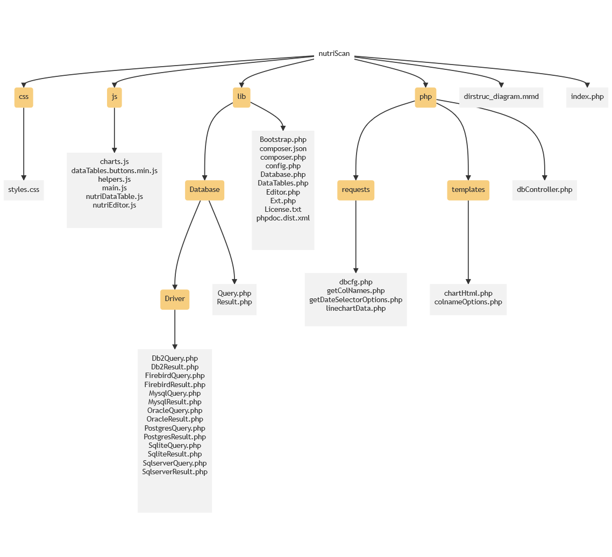

## Description
Pymaid is a tiny tool for creating folder structure diagrams based on mermaids markdown syntax.
The output will be saved in an seperate .mmd file or may be included in a README.md. The idea behind pymaid
is to simple include it in your build tasks for generic charts in your repository.
In the future, image output (svg, png, pdf, ...) will be implemented.



## Installation
```
pip install pymaid
```

## Usage and Examples
- To get information about the tool run `python -m pymaid -h` in the command line.
- For big projects it should be considered to limit the folder depth to a suitable level (e.g. -md 3). 
- Files which should not be includes may be put into the ignore list (-il file1, file2). At the moment no wildcard definition is supported. 
- For git project the mermaid output markdown may be written to the README.md file (-i true). Currently only the file extention .md is supported. 
- Define the direction of the graph (-d TD). TD = Top-Down, LR = Left-Right.

### Scripts
```
from pymaid import diagram
from pymaid import config

# Add files or folders to ignore list
ignore_list = config.ignore_list.copy()
ignore_list.extend([".secrets", "ect.f"])

# Create diagram
diagram.DirStrucTree(ignore = ignore_list)
```
### Command line
```
python -m pymaid [-h] [-r ROOT] [-i INCLUDE_TO_README] [-d DIRECTION] [-md MAXDEPTH] [-il IGNORELIST [IGNORELIST ...]
```

## Todos
- Image format (svg, png, ...) output
- Ignore list should accept regex

## Author 
Manuel Strohmaier / 2021

## License
MIT